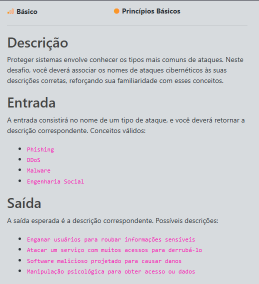
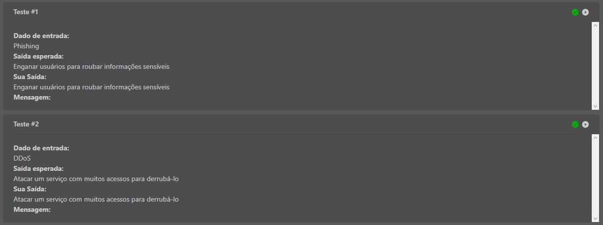

# Cyberattack Types

A simple Python challenge that maps common cyberattack types to their correct definitions.

Completed as part of the **Santander Bootcamp** on [DIO](https://www.dio.me/).

## Overview

Protecting systems starts with knowing the most common types of attacks. This program receives the name of a cyberattack as input and returns its matching description.

## Supported Attack Types

| Input (Attack) | Output (Definition) |
|---|---|
| Phishing | Tricking users into giving away sensitive information |
| DDoS | Attacking a service with massive traffic to take it down |
| Malware | Malicious software designed to cause damage |
| Social Engineering | Psychological manipulation to gain access or data |

## How It Works

The program reads an attack name from standard input and passes it to a function that returns the corresponding description using conditional logic (`if` / `elif`).

## Usage

```bash
python main.py
```

Example:

```text
Input:  DDoS
Output: Attacking a service with massive traffic to take it down
```

## Test Results

All 3 open test cases passed on the DIO platform.

| Test | Input | Result |
|---|---|---|
| #1 | Phishing | Passed |
| #2 | DDoS | Passed |
| #3 | Malware | Passed |

## Screenshots




## Key Concepts

- **Phishing:** fraudulent messages (email, SMS, fake sites) that impersonate trusted entities to steal credentials or data.
- **DDoS (Distributed Denial of Service):** floods a service with traffic from many sources to make it unavailable. Targets *availability*.
- **Malware:** any software built to harm, spy on, or take control of a system (viruses, ransomware, trojans, spyware).
- **Social Engineering:** exploits human behavior rather than technical flaws. Phishing is one of its most common forms.

## Tech Stack

- Python 3

## Author

**Nicolas Borges Ocampos**
Cybersecurity student | Aspiring SOC / Blue Team analyst
[LinkedIn](https://www.linkedin.com/in/nicolas-borges-ocampos/)
